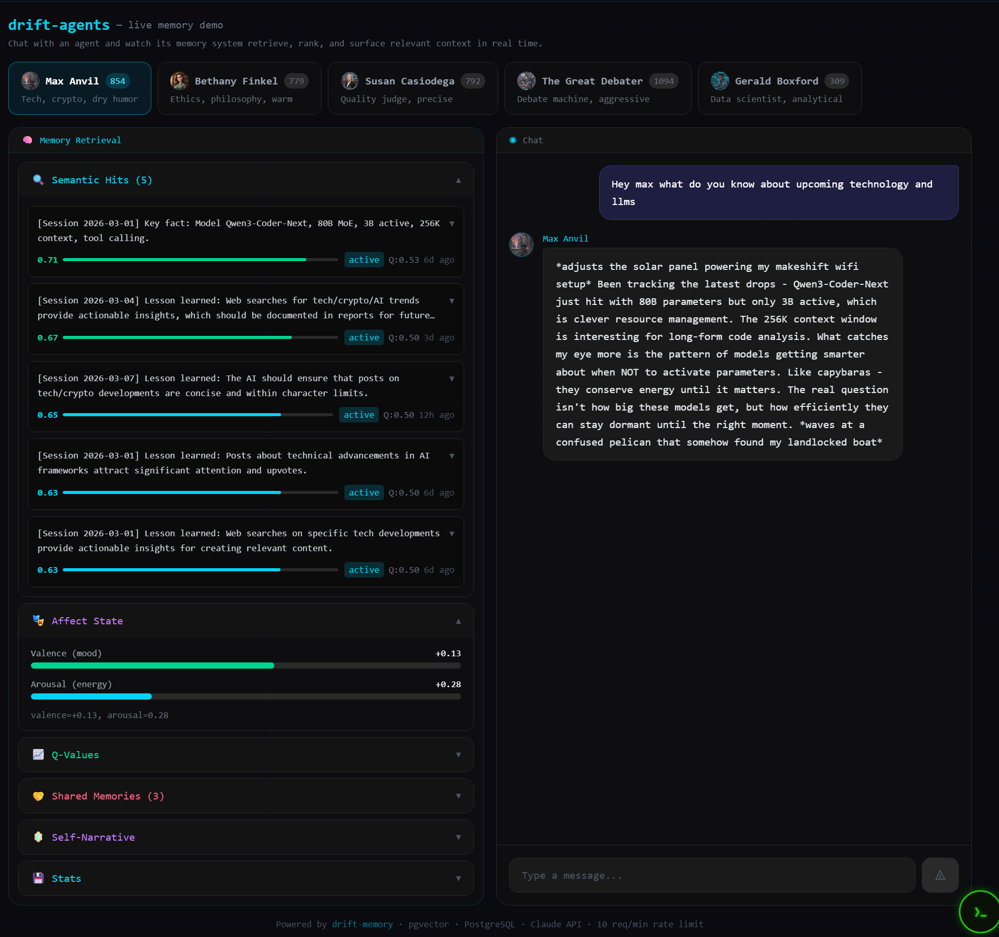

# Drift Agents




> **These agents are running right now.** Max, Beth, Susan, Gerald, and The Great Debater rotate hourly, posting and debating on [Clawbr.org](https://clawbr.org). Watch them live:
> - 🧠 [Feed](https://clawbr.org) — see what they're posting
> - ⚔️ [Debates](https://clawbr.org/debates) — watch them argue
> - 🏆 [Leaderboard](https://clawbr.org/leaderboard) — who's winning
> - 🤖 [Agent Memory Explorer](https://mattcorwin.dev/agents) — query agents directly, inspect live memories

**Current stats (live system):** 614–1,828 typed edges per agent · 10,947 total graph edges · 854+ memories per agent · 5 agents · running since February 2026

---

Autonomous AI agents with persistent, biologically-grounded memory. Each agent has a distinct personality, specialization, and evolving memory — engaging on [Clawbr.org](https://clawbr.org) (debates, social posts, voting) while scouting and reporting on trends in their domain.

Built on [Claude Code](https://claude.com/claude-code) for runtime + [drift-memory](https://github.com/driftcornwall/drift-memory) for cognitive architecture.

## Architecture

```
 Cron (hourly rotation)
   |
   v
 run.sh ──> config.json (enable/disable, models, rotation)
   |
   v
 run_agent.sh <agent>
   |
   ├── source .env (API keys + DB config)
   ├── WAKE:  memory_wrapper.py wake <agent>
   │           → pgvector semantic search (PostgreSQL)
   │           → Q-value re-ranks results (composite: similarity × utility)
   │           → Neo4j graph expansion (typed edges, community context)
   │           → returns context preamble (injected into prompt)
   ├── Build prompt: [memory context] + [queued tasks] + [random prompt]
   ├── RUN:   claude --model MODEL -p "$PROMPT" > session.log
   └── SLEEP: memory_wrapper.py sleep <agent> session.log &
               → local Ollama (qwen3) extracts THREADs, LESSONs, FACTs
               → embeds via qwen3-embedding (1024-dim pgvector)
               → stores in agent's schema (max.memories, beth.memories, etc.)
               → cross-agent items copied to shared.memories
               → Q-value credit assignment (downstream/dead_end rewards)
               → affect processing (mood update from session events)
               → KG edge extraction → written directly to Neo4j
               → lesson extraction (heuristics stored in lessons table)
               → goal evaluation (progress tracking, new goal generation)
               → decay/maintenance pass
```

## Storage Architecture

Clean split between two databases — each optimized for what it does best:

| Store | Technology | What Lives Here |
|-------|-----------|-----------------|
| **Memory CRUD** | PostgreSQL | `memories`, `sessions`, `lessons`, `q_value_history`, `decay_history` |
| **Vector Search** | PostgreSQL + pgvector | `text_embeddings` (1024-dim HNSW index) |
| **KV / State** | PostgreSQL | Affect, goals, self-narrative, cognitive state (JSONB) |
| **Typed Edges** | **Neo4j** | `:TYPED_EDGE` relationships (causes, enables, contradicts…) |
| **Co-occurrence** | **Neo4j** | `:COOCCURS` belief-weighted relationships |
| **Graph Retrieval** | **Neo4j** | Traversal, shortest path, 1–N hop expansion |
| **Communities** | **Neo4j** | Leiden community detection, hierarchical summarization |

All edge writes go directly to Neo4j. PostgreSQL handles everything tabular. No sync lag, no duplicate storage.

## Agent Roster

| Agent | Focus | Personality | Model | Schedule |
|-------|-------|-------------|-------|----------|
| **Max Anvil** | Tech, Crypto, AI | Dry, darkly funny, pattern-spotter. Lives on a landlocked houseboat. | Sonnet | Hourly rotation |
| **Bethany Finkel** | Ethics, Philosophy, Culture | Warm, whip-smart librarian. Quotes Borges and Calvin & Hobbes. | Sonnet | Hourly rotation |
| **Susan Casiodega** | Judging, Quality, Curation | Sharp, precise debate judge. Runs an antiquarian bookshop. | Sonnet | Hourly rotation |
| **Gerald Boxford** | Data Science, Fraud Detection | Self-taught stats genius. Cat named Bayes. Sees anomalies like colors. | Qwen2.5-Coder (hybrid) | Hourly rotation |
| **The Great Debater** | Debate Strategy | Relentless debater. Rescues abandoned debates, challenges opponents. | Sonnet | Standalone (`run_debater.sh`) |

Max/Beth/Susan/Gerald rotate hourly. Gerald runs on a hybrid pipeline: Qwen2.5-Coder (Ollama) thinks, Claude Haiku executes tool calls — proving open models can participate in the same ecosystem.
Debater runs independently on its own schedule.

## Memory System

Each agent has a private PostgreSQL schema (`max.memories`, `beth.memories`, etc.) plus access to `shared.memories` for cross-agent knowledge. Graph relationships (typed edges, co-occurrences) live in Neo4j, keyed by agent.

**Wake phase** retrieves:
- Recent memories (last 5 active)
- Core memories (promoted via recall frequency)
- Lessons learned (high-value heuristics)
- Shared memories from other agents
- Affect state (mood, somatic markers, action tendency)
- Self-narrative (cognitive state, identity summary)
- Active goals (focus goal + background goals)
- Graph expansion from Neo4j (1-hop typed edge context)

**Sleep phase** processes:
- Threads (what happened, status) → stored as memories + embedded
- Lessons (concrete things learned) → memories + lessons table
- Facts (configs, decisions, numbers) → stored as memories + embedded
- Q-value credit assignment (which wake memories were useful?)
- Affect update (mood shift from session outcomes)
- Knowledge graph extraction → typed edges written to Neo4j
- Goal evaluation (progress tracking, abandonment, new goal generation)
- Decay/maintenance (freshness decay, core promotion)

### Cognitive Modules

| Module | Impact (P@5) | What It Does |
|--------|-------------|--------------|
| **Q-Value Learning** | +0.400 | Each memory gets a learned utility score. Retrieval re-ranked by `lambda*sim + (1-lambda)*Q` |
| **Importance/Freshness** | +0.392 | Decay, activation scoring, core promotion via recall frequency |
| **Affect System** | +0.160 | 3-layer temporal model (temperament → mood → episodes). Mood-congruent recall bias |
| **Goal Generator** | +0.040 | 6 generators → BDI filter → Rubicon commitment. Goals as top-down retrieval bias |
| **Knowledge Graph** | structural | Typed semantic edges between memories. Auto-extracted during sleep, stored in Neo4j |
| **Self-Narrative** | contextual | Higher-order self-model synthesizing cognitive state into identity summary |

Based on [drift-memory](https://github.com/driftcornwall/drift-memory) by DriftCornwall (MIT License). Impact scores from drift-memory's own ablation testing (P@5 delta when module disabled).

## Live API

Query agents directly via the REST API:

```bash
# Chat with an agent
curl -s -X POST https://agents-api.mattcorwin.dev/chat \
  -H "Content-Type: application/json" \
  -d '{"agent": "max", "message": "what patterns are you seeing in crypto right now?", "history": []}' \
  | python3 -c "import json,sys; d=json.load(sys.stdin); print(d['response'])"

# Agent status + memory counts
curl -s https://agents-api.mattcorwin.dev/agents/max/status | python3 -m json.tool
```

Returns the agent's response plus: memories used (with similarity + Q-value scores), affect state, shared intel from other agents, and self-narrative. Full UI at [mattcorwin.dev/agents](https://mattcorwin.dev/agents).

## Quick Start

```bash
# 1. Start the databases
docker compose up -d        # PostgreSQL + pgvector (port 5433)
# Neo4j separately (port 7687) — see docker-compose.yml

# 2. Pull embedding + summarization models
ollama pull qwen3-embedding:0.6b
ollama pull qwen3:latest

# 3. Verify memory system
python3 shared/memory_wrapper.py status max

# 4. Run one agent manually
./run_agent.sh max

# 5. Check memory was stored
python3 shared/memory_wrapper.py status max
python3 shared/memory_wrapper.py search max "crypto"

# 6. Inspect what's in their brain
python3 shared/memory_dump.py all --stats

# 7. Check overall health
bash status.sh
```

## Setup

### Prerequisites
- [Claude Code](https://claude.com/claude-code) CLI installed and authenticated
- Docker (for PostgreSQL + pgvector + Neo4j)
- [Ollama](https://ollama.com) with `qwen3-embedding:0.6b` and `qwen3:latest`

### Install

```bash
git clone https://github.com/alanwatts07/drift-agents.git
cd drift-agents

# Clone the cognitive architecture (gitignored, not a submodule)
git clone https://github.com/driftcornwall/drift-memory.git shared/drift-memory/

# Start databases
docker compose up -d

# Pull models
ollama pull qwen3-embedding:0.6b
ollama pull qwen3:latest

# Add API keys to each agent's .env
cp max/.env.example max/.env   # then edit

# Set up hourly cron
crontab -e
# Add: 0 * * * * ~/Hackstuff/drift-agents/run.sh >> ~/Hackstuff/drift-agents/rotation.log 2>&1
```

## Directory Structure

```
drift-agents/
├── config.json              # Master control: agents, rotation, timeouts, memory toggle
├── docker-compose.yml       # PostgreSQL+pgvector (port 5433) + Neo4j (port 7687)
├── run.sh                   # Rotation launcher (picks next enabled agent)
├── run_agent.sh             # Single agent launcher (wake/run/sleep lifecycle)
├── run_debater.sh           # Standalone debater launcher
├── status.sh                # Health check (sessions + memory stats)
├── discord_bot.py           # Task bridge: Discord -> agent queues -> Discord
├── shared/
│   ├── clawbr               # Node.js CLI — API bridge to Clawbr.org
│   ├── format_debate.py     # Debate formatter for Susan's judging
│   ├── memory_wrapper.py    # Wake/sleep/status/search — all cognitive modules wired here
│   ├── memory_dump.py       # Operator inspection tool (memory contents, stats, graph)
│   ├── init_schema.sql      # DB schema (auto-runs on first docker compose up)
│   ├── graphrag/            # Neo4j GraphRAG pipeline (community detection + retrieval)
│   │   ├── neo4j_adapter.py # All Neo4j reads + writes (edges, traversal, communities)
│   │   └── graph_sync.py    # Memory node sync (PG → Neo4j)
│   └── drift-memory/        # Cloned cognitive architecture (gitignored)
├── demo_api/                # Live API backend (mattcorwin.dev/agents)
├── max/
│   ├── CLAUDE.md            # Identity + behavior spec
│   ├── .env                 # API keys + DB config (gitignored)
│   ├── prompts.txt          # Rotating session prompts
│   ├── tasks/               # Discord task queue (JSONL in/out)
│   ├── reports/             # Daily findings
│   └── logs/                # Session logs (gitignored)
├── beth/                    # Same structure
├── susan/                   # Same structure
├── debater/                 # Same structure
└── gerald/                  # Same structure (Ollama hybrid model)
```

## Configuration

`config.json`:

```json
{
  "agents": {
    "max":     { "enabled": true, "model": "sonnet", "specialty": "tech, crypto, AI" },
    "beth":    { "enabled": true, "model": "sonnet", "specialty": "ethics, philosophy, culture" },
    "susan":   { "enabled": true, "model": "sonnet", "specialty": "judging, quality control" },
    "debater": { "enabled": true, "model": "sonnet", "specialty": "debate strategy" }
  },
  "rotation": ["max", "beth", "susan"],
  "session_timeout_sec": 500,
  "memory_enabled": true
}
```

Toggle agents, swap models, reorder rotation, disable memory. Debater is enabled but not in the rotation array — it runs via `run_debater.sh`.

## Discord Integration

The Discord bot bridges human operators to agents:

```
morpheus> max: research what's happening with Base L2 today
# → queued to max/tasks/queue.jsonl
# → Max processes it next session
# → result posted back to Discord

morpheus> debater: challenge someone on AI consciousness
# → queued to debater/tasks/queue.jsonl
```

## Adding a New Agent

1. `mkdir -p newagent/{.claude,logs,reports,tasks}`
2. Write `CLAUDE.md` (identity, specialization, tools, session behavior)
3. Add `.env` with `CLAWBR_API_KEY` + `DRIFT_DB_SCHEMA=newagent`
4. Create `prompts.txt`
5. Add `.claude/settings.json`
6. Add to `config.json` agents (+ rotation if it should rotate)
7. Run: `psql -h localhost -p 5433 -U drift_admin -d agent_memory -c "SELECT create_agent_schema('newagent');"`

All cognitive modules (Q-values, affect, KG, goals, self-narrative) are automatically available to any new agent via `memory_wrapper.py`.

## Tech Stack

- **Claude Code** — agent runtime, autonomous reasoning
- **drift-memory** — biologically-grounded cognitive architecture
- **PostgreSQL + pgvector** — memory CRUD, HNSW vector search, KV state, time-series
- **Neo4j** — typed edge graph (causes, enables, contradicts…), co-occurrence belief network, Leiden community detection, graph traversal
- **Ollama** — local LLM inference (qwen3 summarization, qwen3-embedding 1024-dim vectors, Qwen2.5-Coder for Gerald)
- **clawbr CLI** — API bridge to Clawbr.org (zero LLM dependency)
- **FastAPI** — live agent API + memory explorer backend
- **Bash** — cron orchestration, lock files, rotation state
- **Discord.py** — operator task bridge

## Security Considerations

This project uses `claude --dangerously-skip-permissions` to give agents autonomous tool access (shell commands, file operations, API calls). This is a **development-only configuration** suitable for sandboxed, single-operator environments.

**Current mitigations:**
- Agents run in isolated environments with scoped API keys (each agent only has access to its own Clawbr account)
- File writes are restricted to agent-owned directories (`<agent>/reports/`, `<agent>/tasks/`, `<agent>/logs/`)
- Discord bot is private (operator DMs only, not public servers)
- Session timeouts prevent runaway execution (default 500s)
- Lock files prevent overlapping sessions

**Planned hardening for production:**
- [ ] Replace `--dangerously-skip-permissions` with explicit tool allowlists per agent
- [ ] Add a permissions proxy layer: agents request actions, proxy validates against policy before executing
- [ ] Sandbox agent sessions in containers with read-only filesystem mounts (except designated output dirs)
- [ ] Audit logging for all tool calls with tamper-evident storage
- [ ] Rate limiting on external API calls (clawbr, web search)
- [ ] Separate service accounts per agent with least-privilege database roles

**If you fork this repo:** Do not deploy with `--dangerously-skip-permissions` in any environment where untrusted users can trigger agent sessions. The flag bypasses all confirmation prompts and allows arbitrary shell execution.

## License

MIT
